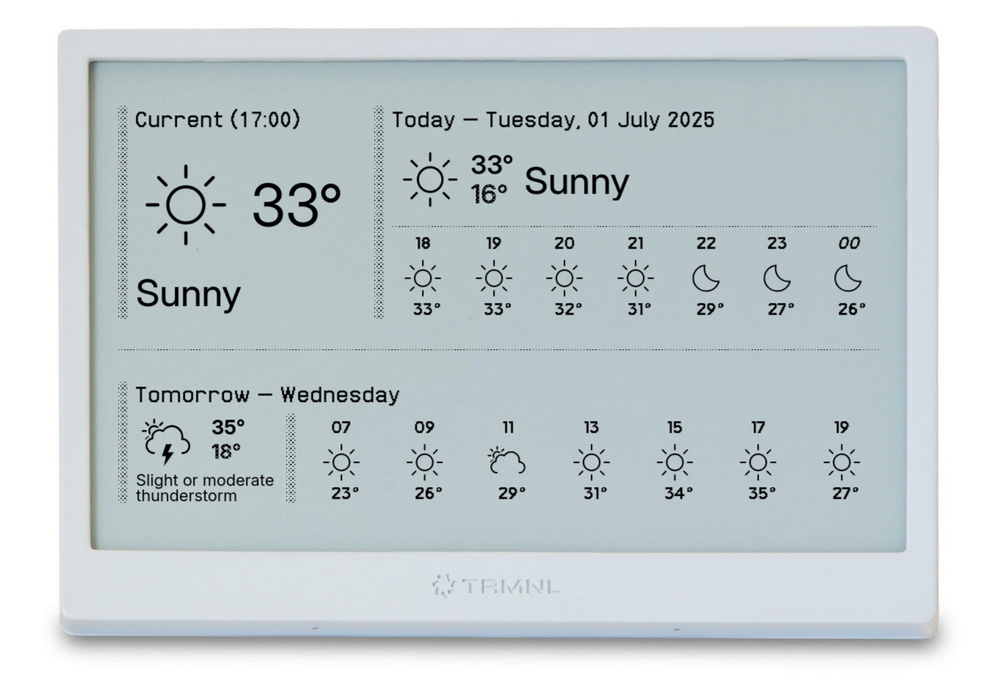
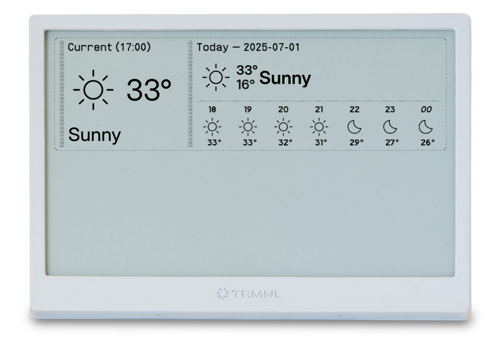

# Open-Meteo Hourly Weather Forecast TRMNL Plugin



Inspired by the stock Weather App on IOS. Using Open-Meteo backend, no API key needed.
Using [beautiful SVG icons by basmilius](https://github.com/basmilius/weather-icons), forked and
then hosted on GitHub Pages [here](https://github.com/andi4000/weather-icons).

Open-Meteo API Documentation: https://open-meteo.com/en/docs

Mapping between (WMO) weather code to icon and multi-language description is provided by this
GitHub project: https://github.com/andi4000/weather-app-assets
The first draft was generated with AI help, so it might not be 100% accurate. PRs are welcome :)

## Other Formats
<details>
<summary>Half Horizontal</summary>


</details>

<details>
<summary>Half Vertical</summary>


</details>

<details>
<summary>Quadrant</summary>


</details>

## Usage
1. Download plugin zip file from [latest release](https://github.com/andi4000/trmnl-open-meteo-weather-forecast/releases/latest)
1. Import zip file into your TRMNL Private Plugin (Plugins > Private Plugin > Import New)
1. Enter the Latitude and Longitude of your location
1. Configure other fields as needed
1. **NOTE**: if you see "Liquid error" messages on display, it is because TRMNL server hasn't fetched the weather data yet. Wait a few minutes or force update via link on the sidebar.
1. ?
1. Profit

## Known Issues
#### Weather icon, i.e. `weather_code` for daily forecast (today and tomorrow) is wild
> Is there a special reason behind showing the worst case weathercode in daily values?

> Well... simplicity ;-) It also has more issues like precipitation at night and sunny throughout the day.

Upstream issue: open-meteo/open-meteo#228

Ideas for a fix: andi4000/trmnl-open-meteo-weather-forecast#1


## Development
Requires docker.

```bash
cp .trmnlp.yml.sample .trmnlp.yml
# edit the file accordingly, then

./bin/trmnlp
```

### Release
```bash
# (lightweight) tag the repo and push it, using this wrapper script. GH Action will create a release.
./bin/bumpversion minor  # major,minor,patch
```